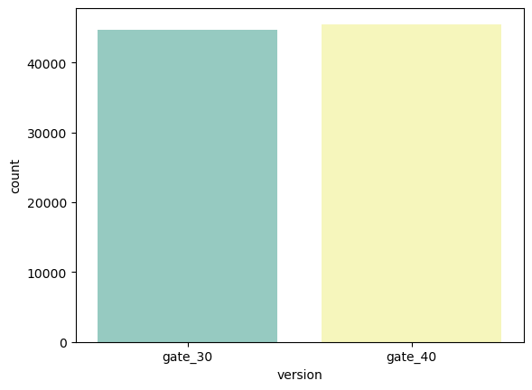
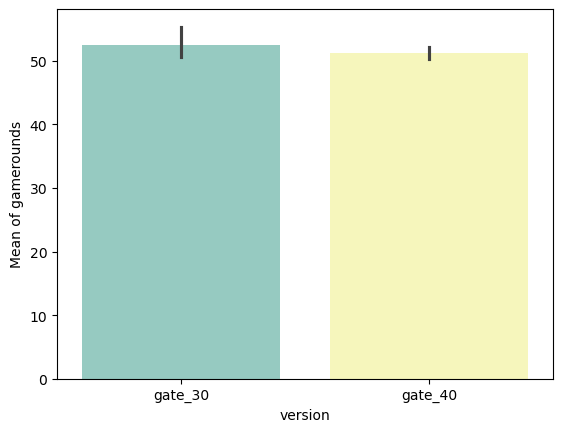
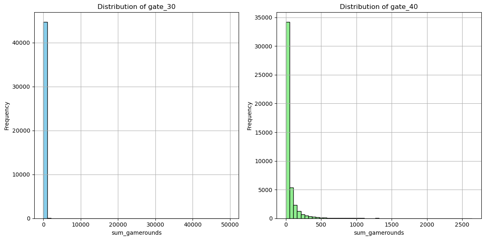
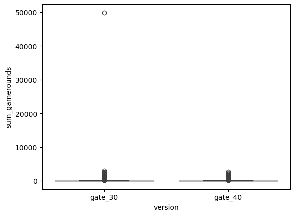
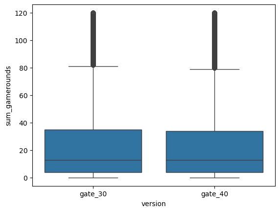
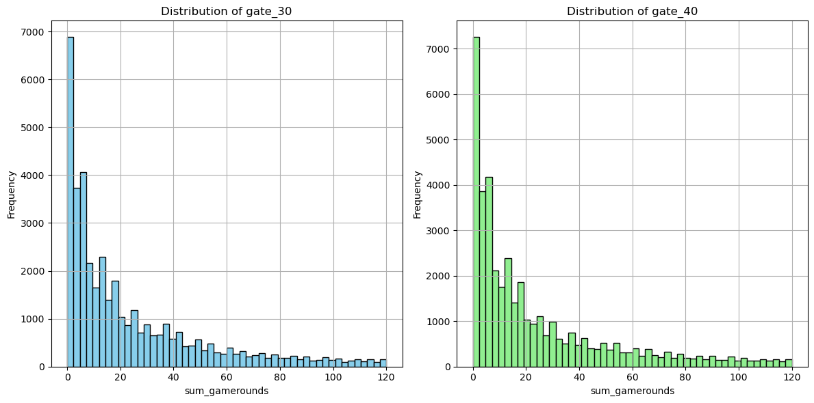
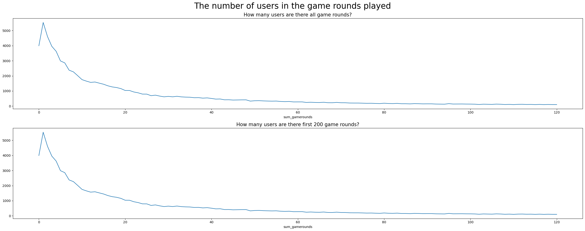

<h1 style="text-align:center; color:#000080; font-weight:bold; font-size:38px;">
手机游戏：A/B 测试</h1>

## **项目介绍:** 
- Cookie Cat是国外一款类似开心消消乐的游戏，玩家通过滑动方块，将相同颜色的方块移动到一起可以消除方块得到分数，达到分数规定就可以通关。当玩家达到一定数量的关卡后，若想继续玩，则会出现一个“游戏门”的窗口，这个门会要求用户休息一段时间再继续玩或者花钱继续玩。这种“游戏门”的机制是想让玩家能够离开手机休息一段时间，同时也想延长用户的在线时间。
- 原始版本中， “游戏门”被放置在了第30关，现在Cookie Cat公司想要更改放置“游戏门”的关卡数，他们想知道“游戏门”放置在第30关还是第40关更好，项目的要求就是设计一次AB试验，做出决策。

---
## 一、A/B测试的数据集描述
Cookie Cat 是由 Tactile Entertainment 开发的一款非常受欢迎的手机益智游戏,该数据集包括 Cookie Cats 的 A/B 测试结果，该实验旨在评估关卡位置对玩家保留和参与度的影响。这些数据非常适合进行 A/B 测试，以确定当“游戏门”位于第30关或第40关时，玩家是否更有可能继续玩游戏。
### 1.1 数据集各个字段的解释
**①**player_id  
- 含义：数据集中每个玩家的唯一标识符
- 类型：分类变量

**②**version
- 含义：表示玩家是属于对照组还是测试组，其中gate_30表示“游戏门”位于第30关，gate_40表示“游戏门”位于第40关
- 类型：分类变量

**③**sum_gamerounds
- 含义：玩家在安装后的前 14 天内玩的游戏总轮数
- 类型：数字（整数）
- 意义：衡量玩家参与度并作为测试的关键绩效指标

**④**retention_1
- 含义：表示玩家是否在安装后第1天回归游戏，如果数据是1 则表示玩家返回
- 意义：用于评估玩家即时参与度的短期留存指标

**⑤**retention_7
- 含义：表示玩家是否在安装后第7天回归游戏，如果数据是1 则表示玩家返回
- 意义：用于评估持续玩家兴趣的长期留存指标  

---
## 二、A/B测试目标
本次分析的核心目标是确定进度关卡的位置是否显著影响玩家留存率和参与度。具体需要解答以下问题：
### 2.1留存率
相较于第30关（gate_30），将“游戏门”设置在第40关（gate_40）是否能显著提升玩家的1日留存率和7日留存率？
### 2.2参与度
“游戏门”位置是否会影响前 14 天内进行的游戏总轮数 （sum_gamerounds）？  

---

## 三、分析计划
### 3.1数据清理和准备
- 处理缺失值或者不一致的值
- 确保 gate_30 与 gate_40 的组规模保持平衡
### 3.2描述性统计
- 探索两个组的平均值，中位数，以及 sum_gamerounds、retention_1 和 retention_7 的分布

### 3.3 假设检验
- 使用双比例Z检验比较1日留存率（retention_1）和7日留存率（retention_7）
- 执行 t 检验或 Mann-Whitney U 检验以分析 sum_gamerounds 差异
### 3.4 可视化
- 使用条形图、箱线图或直方图比较留存率和游戏回合数。

---


<a id="1"></a>
# <div style="text-align:center; border-radius:25px 70px; padding:9px; color:white; margin:0; font-size:150%; font-family:Pacifico; background-color:#2196F3; overflow:hidden"><b>导入库</b></div>


```python
import numpy as np
import pandas as pd 
import seaborn as sns
import matplotlib.pyplot as plt
import os
#假设检验所需库
# -----------------------------------
from scipy.stats import shapiro, ttest_ind, mannwhitneyu, levene
import scipy.stats as stats
#移除警告信息
import warnings
warnings.filterwarnings("ignore")
```

<a id="1"></a>
# <div style="text-align:center; border-radius:25px 70px; padding:9px; color:white; margin:0; font-size:150%; font-family:Pacifico; background-color:#2196F3; overflow:hidden"><b>数据预处理</b></div>


```python
df = pd.read_csv('cookie_cats.csv')
df.head()
```


<div>
<style scoped>
    .dataframe tbody tr th:only-of-type {
        vertical-align: middle;
    }

    .dataframe tbody tr th {
        vertical-align: top;
    }

    .dataframe thead th {
        text-align: right;
    }
</style>
<table border="1" class="dataframe">
  <thead>
    <tr style="text-align: right;">
      <th></th>
      <th>userid</th>
      <th>version</th>
      <th>sum_gamerounds</th>
      <th>retention_1</th>
      <th>retention_7</th>
    </tr>
  </thead>
  <tbody>
    <tr>
      <th>0</th>
      <td>116</td>
      <td>gate_30</td>
      <td>3</td>
      <td>False</td>
      <td>False</td>
    </tr>
    <tr>
      <th>1</th>
      <td>337</td>
      <td>gate_30</td>
      <td>38</td>
      <td>True</td>
      <td>False</td>
    </tr>
    <tr>
      <th>2</th>
      <td>377</td>
      <td>gate_40</td>
      <td>165</td>
      <td>True</td>
      <td>False</td>
    </tr>
    <tr>
      <th>3</th>
      <td>483</td>
      <td>gate_40</td>
      <td>1</td>
      <td>False</td>
      <td>False</td>
    </tr>
    <tr>
      <th>4</th>
      <td>488</td>
      <td>gate_40</td>
      <td>179</td>
      <td>True</td>
      <td>True</td>
    </tr>
  </tbody>
</table>
</div>


```python
df.shape
```


    (90189, 5)


```python
df.info()
```

    <class 'pandas.core.frame.DataFrame'>
    RangeIndex: 90189 entries, 0 to 90188
    Data columns (total 5 columns):
     #   Column          Non-Null Count  Dtype 
    ---  ------          --------------  ----- 
     0   userid          90189 non-null  int64 
     1   version         90189 non-null  object
     2   sum_gamerounds  90189 non-null  int64 
     3   retention_1     90189 non-null  bool  
     4   retention_7     90189 non-null  bool  
    dtypes: bool(2), int64(2), object(1)
    memory usage: 2.2+ MB
    


```python
df.isna().sum()
```


    userid            0
    version           0
    sum_gamerounds    0
    retention_1       0
    retention_7       0
    dtype: int64


```python
df.duplicated().sum()
```


    0


```python
df.describe()[["sum_gamerounds"]].T
```


<div>
<style scoped>
    .dataframe tbody tr th:only-of-type {
        vertical-align: middle;
    }

    .dataframe tbody tr th {
        vertical-align: top;
    }

    .dataframe thead th {
        text-align: right;
    }
</style>
<table border="1" class="dataframe">
  <thead>
    <tr style="text-align: right;">
      <th></th>
      <th>count</th>
      <th>mean</th>
      <th>std</th>
      <th>min</th>
      <th>25%</th>
      <th>50%</th>
      <th>75%</th>
      <th>max</th>
    </tr>
  </thead>
  <tbody>
    <tr>
      <th>sum_gamerounds</th>
      <td>90189.0</td>
      <td>51.872457</td>
      <td>195.050858</td>
      <td>0.0</td>
      <td>5.0</td>
      <td>16.0</td>
      <td>51.0</td>
      <td>49854.0</td>
    </tr>
  </tbody>
</table>
</div>


从describe的信息中，我们可以猜测sum_gamerounds变量可能不是正态分布的，因为中位数是16，而平均值是51.8。


```python
df.groupby('version')['sum_gamerounds'].agg(["count", "median", "mean", "std", "max"])
```


<div>
<style scoped>
    .dataframe tbody tr th:only-of-type {
        vertical-align: middle;
    }

    .dataframe tbody tr th {
        vertical-align: top;
    }

    .dataframe thead th {
        text-align: right;
    }
</style>
<table border="1" class="dataframe">
  <thead>
    <tr style="text-align: right;">
      <th></th>
      <th>count</th>
      <th>median</th>
      <th>mean</th>
      <th>std</th>
      <th>max</th>
    </tr>
    <tr>
      <th>version</th>
      <th></th>
      <th></th>
      <th></th>
      <th></th>
      <th></th>
    </tr>
  </thead>
  <tbody>
    <tr>
      <th>gate_30</th>
      <td>44700</td>
      <td>17.0</td>
      <td>52.456264</td>
      <td>256.716423</td>
      <td>49854</td>
    </tr>
    <tr>
      <th>gate_40</th>
      <td>45489</td>
      <td>16.0</td>
      <td>51.298776</td>
      <td>103.294416</td>
      <td>2640</td>
    </tr>
  </tbody>
</table>
</div>


## **数据洞察**
### 1.中心趋势
- 两组中中位数都明显小于平均值，表明数据是右偏的
### 2.标准差
- 与 gate_40 （103.29） 相比，gate_30 的标准差明显更高 （256.72），表明 gate_30 组的游戏总回合数变化更大
### 3.最大值
- gate_30 的最大值 （49,854） 远高于 gate_40 （2,640）。这种极端差异进一步支持了 gate_30 组中存在异常值的想法。
### 4.总结
- 变异性的差异和异常值的存在可能会影响统计检验（例如，t 检验）的结果。建议在得出结论之前进一步检查数据分布，例如通过直方图或箱线图。

---
## **基于分析的建议**
- 可视化两组的 sum_gamerounds 分布，以确认偏度并检测异常值。
- 如果不满足正态性假设，请使用非参数检验 （例如，Mann-Whitney U 检验）。
- 考虑删除极端异常值或单独分析其影响。

<a id="1"></a>
# <div style="text-align:center; border-radius:25px 70px; padding:9px; color:white; margin:0; font-size:150%; font-family:Pacifico; background-color:#2196F3; overflow:hidden"><b>数据可视化</b></div>


```python
#查看两组玩家数量
sns.countplot(x="version",data=df, palette="Set3");
plt.show()
```


    

    


```python

sns.barplot(x='version', y='sum_gamerounds', data=df, palette="Set3")

plt.ylabel("Mean of gamerounds");
```


    

    


```python
def plot_histograms(df, col, group_col, group_1, group_2):

    plt.figure(figsize=(12, 6))  
    

    plt.subplot(1, 2, 1) 
    df[df[group_col] == group_1][col].hist(bins=50, color='skyblue', edgecolor='black')
    plt.title(f"Distribution of {group_1}")
    plt.xlabel(col)
    plt.ylabel("Frequency")
    

    plt.subplot(1, 2, 2)  
    df[df[group_col] == group_2][col].hist(bins=50, color='lightgreen', edgecolor='black')
    plt.title(f"Distribution of {group_2}")
    plt.xlabel(col)
    plt.ylabel("Frequency")
    

    plt.tight_layout() 
    plt.show()
```


```python
#绘制频率图
plot_histograms(df, col="sum_gamerounds", 
                group_col="version", group_1="gate_30", 
                group_2="gate_40")
```


    

    


```python
#绘制箱线图
sns.boxplot(data=df, x="version", y="sum_gamerounds");
plt.show();
```


    

    


可以看出，确实存在异常值

## **删除异常值**


```python

def remove_outliers(df, col):
    Q1 = df[col].quantile(0.25)
    Q3 = df[col].quantile(0.75)
    IQR = Q3 - Q1
    
    lower_bound = Q1 - 1.5 * IQR
    upper_bound = Q3 + 1.5 * IQR
    
    df_cleaned = df[(df[col] >= lower_bound) & (df[col] <= upper_bound)]
    
    return df_cleaned
```


```python
df = remove_outliers(df, 'sum_gamerounds')
```


```python
sns.boxplot(data=df, x="version", y="sum_gamerounds");
plt.show();
```


    

    


```python
plot_histograms(df, col="sum_gamerounds", 
                group_col="version", group_1="gate_30", 
                group_2="gate_40")
```


    

    


<a id="1"></a>
# <div style="text-align:center; border-radius:25px 70px; padding:9px; color:white; margin:0; font-size:150%; font-family:Pacifico; background-color:#2196F3; overflow:hidden"><b>用户行为分析</b></div>

## 一、主要发现
### 1.1 3994位用户安装了游戏但从未玩过
- 可能的原因有：
  - 用户**没有空闲时间**玩。
  - 他们可能已经更喜欢玩**其他游戏**了。
  - 有些用户在安装后可能**不喜欢该应用程序**。
  - 其他技术或个人因素也可能影响行为！

### 1.2深层用户参与度下降
- 随着游戏进程推进，活跃玩家数量逐级递减
- 大多数用户在初期阶段积极参与，但难以继续推进

---
## 二、提高用户留存率的建议
### 2.1研究和收集数据
- Tactile Entertainment公司应重点关注理解**用户流失的原因**
- 问卷调查、用户反馈和行为数据可以提供洞察
### 2.2衡量游戏难度
- 分析游戏是否随着关卡的进展而变得太难
- 调整难度有助于保持用户兴趣
### 2.3实施留存策略
- 引入游戏内奖励或礼物，以激励玩家不断进步
- 为每日登录或完成挑战的玩家提供奖励
---
## 三、结论
了解用户行为、衡量流失点并实施有针对性的策略可以显著提高用户保留率和游戏参与度


```python
fig, axes = plt.subplots(2, 1, figsize = (25,10))
df.groupby("sum_gamerounds").userid.count().plot(ax = axes[0])
df.groupby("sum_gamerounds").userid.count()[:200].plot(ax = axes[1])
plt.suptitle("The number of users in the game rounds played", fontsize = 25)
axes[0].set_title("How many users are there all game rounds?", fontsize = 15)
axes[1].set_title("How many users are there first 200 game rounds?", fontsize = 15)
plt.tight_layout();
plt.show();
```


    

    


```python
df.groupby("version")['sum_gamerounds'].agg(["count", "median", "mean", "std", "max"])
```


<div>
<style scoped>
    .dataframe tbody tr th:only-of-type {
        vertical-align: middle;
    }

    .dataframe tbody tr th {
        vertical-align: top;
    }

    .dataframe thead th {
        text-align: right;
    }
</style>
<table border="1" class="dataframe">
  <thead>
    <tr style="text-align: right;">
      <th></th>
      <th>count</th>
      <th>median</th>
      <th>mean</th>
      <th>std</th>
      <th>max</th>
    </tr>
    <tr>
      <th>version</th>
      <th></th>
      <th></th>
      <th></th>
      <th></th>
      <th></th>
    </tr>
  </thead>
  <tbody>
    <tr>
      <th>gate_30</th>
      <td>39638</td>
      <td>13.0</td>
      <td>23.945179</td>
      <td>27.152547</td>
      <td>120</td>
    </tr>
    <tr>
      <th>gate_40</th>
      <td>40374</td>
      <td>13.0</td>
      <td>24.012558</td>
      <td>27.800704</td>
      <td>120</td>
    </tr>
  </tbody>
</table>
</div>


```python
df.groupby(["version", "retention_1"])['sum_gamerounds']\
                            .agg(["count", "median", "mean", "std", "max"])
```


<div>
<style scoped>
    .dataframe tbody tr th:only-of-type {
        vertical-align: middle;
    }

    .dataframe tbody tr th {
        vertical-align: top;
    }

    .dataframe thead th {
        text-align: right;
    }
</style>
<table border="1" class="dataframe">
  <thead>
    <tr style="text-align: right;">
      <th></th>
      <th></th>
      <th>count</th>
      <th>median</th>
      <th>mean</th>
      <th>std</th>
      <th>max</th>
    </tr>
    <tr>
      <th>version</th>
      <th>retention_1</th>
      <th></th>
      <th></th>
      <th></th>
      <th></th>
      <th></th>
    </tr>
  </thead>
  <tbody>
    <tr>
      <th rowspan="2" valign="top">gate_30</th>
      <th>False</th>
      <td>24215</td>
      <td>6.0</td>
      <td>12.642660</td>
      <td>17.491398</td>
      <td>120</td>
    </tr>
    <tr>
      <th>True</th>
      <td>15423</td>
      <td>35.0</td>
      <td>41.690786</td>
      <td>29.983310</td>
      <td>120</td>
    </tr>
    <tr>
      <th rowspan="2" valign="top">gate_40</th>
      <th>False</th>
      <td>24896</td>
      <td>6.0</td>
      <td>12.655165</td>
      <td>17.972346</td>
      <td>120</td>
    </tr>
    <tr>
      <th>True</th>
      <td>15478</td>
      <td>34.0</td>
      <td>42.280656</td>
      <td>30.908286</td>
      <td>120</td>
    </tr>
  </tbody>
</table>
</div>


尽管不同版本组别的留存率变量统计摘要与游戏回合数（sum_gamerounds）存在相似性，但进一步验证组间差异是否具有统计学显著性更为关键。

<a id="1"></a>
# <div style="text-align:center; border-radius:25px 70px; padding:9px; color:white; margin:0; font-size:150%; font-family:Pacifico; background-color:#2196F3; overflow:hidden"><b>A/B测试</b></div>


## 一、建立假设

- **H₀ (原假设):** M₁ = M₂  
   *`gate_30` 和 `gate_40`之间没有统计差异。*  
- **H₁ (备择假设):** M₁ ≠ M₂  
   *`gate_30` 和 `gate_40`之间存在统计差异*

---

## 二、假设检验

### 2.1 异常值分析
- 在测试**正态性**之前执行异常值检测和校正。

### 2.2 正态性假设 (Shapiro-Wilk检验)
- **H₀:** 分布为正态分布。
- **H₁:** 分布不是正态的。 

**p值规制:**
- 如果 **p < 0.05** → 拒绝 H₀（分布不正态）。  
- 如果 **p > 0.05** → 拒绝 H₀ 失败（分布为正态）。  

### 2.3 方差同质性 (Levene检验)
- **H₀:** 方差是同质的。
- **H₁:** 方差不是同质的。

---

## 三、假设检验的实施

基于以下假设:
- 如果**分布**为**正态**且**方差均匀** →则使用 **T 检验** （参数检验）.. 
- 如果**分布**为**正态**分布且**方差不均匀** →则使用**Welch 检验** 
- 如果**分布不是正态分布**→则使用**Mann-Whitney U 检验**（非参数检验）。

---

## 四、解释结果并评估假设

**p值规则:**
- 如果**p < 0.05** →  →拒绝 H₀（存在显着差异）。 
- 如果**p > 0.05** → 拒绝 H₀ 失败（无显着差异）。

---


```python
df["version"] = np.where(df["version"] == "gate_30", "A", "B")
df.head()
```


<div>
<style scoped>
    .dataframe tbody tr th:only-of-type {
        vertical-align: middle;
    }

    .dataframe tbody tr th {
        vertical-align: top;
    }

    .dataframe thead th {
        text-align: right;
    }
</style>
<table border="1" class="dataframe">
  <thead>
    <tr style="text-align: right;">
      <th></th>
      <th>userid</th>
      <th>version</th>
      <th>sum_gamerounds</th>
      <th>retention_1</th>
      <th>retention_7</th>
    </tr>
  </thead>
  <tbody>
    <tr>
      <th>0</th>
      <td>116</td>
      <td>A</td>
      <td>3</td>
      <td>False</td>
      <td>False</td>
    </tr>
    <tr>
      <th>1</th>
      <td>337</td>
      <td>A</td>
      <td>38</td>
      <td>True</td>
      <td>False</td>
    </tr>
    <tr>
      <th>3</th>
      <td>483</td>
      <td>B</td>
      <td>1</td>
      <td>False</td>
      <td>False</td>
    </tr>
    <tr>
      <th>6</th>
      <td>1066</td>
      <td>A</td>
      <td>0</td>
      <td>False</td>
      <td>False</td>
    </tr>
    <tr>
      <th>7</th>
      <td>1444</td>
      <td>B</td>
      <td>2</td>
      <td>False</td>
      <td>False</td>
    </tr>
  </tbody>
</table>
</div>


```python
#A/B测试
def AB_Test(dataframe, group, target):
    
    # A/B Testing Hypothesis
    # H0: A == B
    # H1: A != B 

    
    # Split data into two groups (A and B)
    groupA = dataframe[dataframe[group] == "A"][target]
    groupB = dataframe[dataframe[group] == "B"][target]
    
    # Check normality with Shapiro test
    normalA = shapiro(groupA)[1] > 0.05  # H0: Normal
    normalB = shapiro(groupB)[1] > 0.05  # H0: Normal
    
    # Perform A/B Test based on assumptions
    if normalA and normalB:
        # Check homogeneity of variance with Levene's test
        homogeneity = levene(groupA, groupB)[1] > 0.05  # H0: Homogeneous variance
        
        if homogeneity:
            # Perform T-test if both normal and variances are homogeneous
            p_value = ttest_ind(groupA, groupB, equal_var=True)[1]
            test_type = "Parametric (T-test, Homogeneous)"
        else:
            # Perform Welch's T-test if variances are not homogeneous
            p_value = ttest_ind(groupA, groupB, equal_var=False)[1]
            test_type = "Parametric (T-test, Heterogeneous)"
    else:
        # If distributions are not normal, perform Mann-Whitney U Test
        p_value = mannwhitneyu(groupA, groupB)[1]
        test_type = "非参数检验(Mann-Whitney U)"

    # Determine whether to reject or fail to reject the null hypothesis
    result = "拒绝 H0" if p_value < 0.05 else "不拒绝 H0"
    comment = "A/B 组存在显著差异" if result == "拒绝 H0" else "A/B 组不存在显著差异!"
    
    # Compile results into a DataFrame
    summary = pd.DataFrame({
        "Test Type": [test_type],
        "p-value": [p_value],
        "AB Hypothesis": [result],
        "Comment": [comment]
    })
    
    return summary
```


```python
AB_Test(dataframe=df, group = "version", target = "sum_gamerounds")
```


<div>
<style scoped>
    .dataframe tbody tr th:only-of-type {
        vertical-align: middle;
    }

    .dataframe tbody tr th {
        vertical-align: top;
    }

    .dataframe thead th {
        text-align: right;
    }
</style>
<table border="1" class="dataframe">
  <thead>
    <tr style="text-align: right;">
      <th></th>
      <th>Test Type</th>
      <th>p-value</th>
      <th>AB Hypothesis</th>
      <th>Comment</th>
    </tr>
  </thead>
  <tbody>
    <tr>
      <th>0</th>
      <td>非参数检验(Mann-Whitney U)</td>
      <td>0.038855</td>
      <td>拒绝 H0</td>
      <td>A/B 组存在显著差异</td>
    </tr>
  </tbody>
</table>
</div>


```python
df.groupby("version")['retention_1'].mean(), df.groupby("version")['retention_7'].mean()
```


    (version
     A    0.389096
     B    0.383366
     Name: retention_1, dtype: float64,
     version
     A    0.118119
     B    0.109798
     Name: retention_7, dtype: float64)


<a id="1"></a>
# <div style="text-align:center; border-radius:25px 70px; padding:9px; color:white; margin:0; font-size:150%; font-family:Pacifico; background-color:#2196F3; overflow:hidden"><b>结论</b></div>

### 一、业务问题回顾
该项目分析了将 **Cookie Cats**中的第一个“移动门”从 30 关移到40关对玩家**留存率**和**游戏回合数**的影响。

### 二、主要发现

- **留存率:**
  - 与 40 关相比，当门处于 **30** 关时，**7 天的留存率**明显更高。
  - 处于30关的“移动门”的 1 天和 7 天保留率略高，这表明较早的障碍提高了留存率

- **A/B 测试结果:**
  - **Shapiro 检验**拒绝了正态性假设，因此使用了**非参数检验 （Mann-Whitney U）**。
  - **Mann-Whitney U 检验**显示两组之间存在统计学上的显着差异，表明将门从 30 关移至 40 关会影响玩家参与度。

### 三、为什么们处在30关的留存率更高?
- **享乐适应**理论解释了为什么较早的门可以提高保留率。随着玩家的进步，他们对游戏的乐趣可能会降低。引入更早的大门迫使玩家休息，随着时间的推移保持他们的乐趣。
- 如果将门移动到40关，达到该点的玩家就会减少，而达到该点的玩家可能会因无聊而退出。

### 四、最终建议
根据分析，将门保持在 **30关**是保持 1 天和 7 天高留存率的更好选择。

- 虽然**游戏回合数**和**应用内购买**等其他指标很重要，但**留存率**对于游戏的成功至关重要。强大的玩家基础可确保长期成功，无论游戏内支出如何。


```python

```
